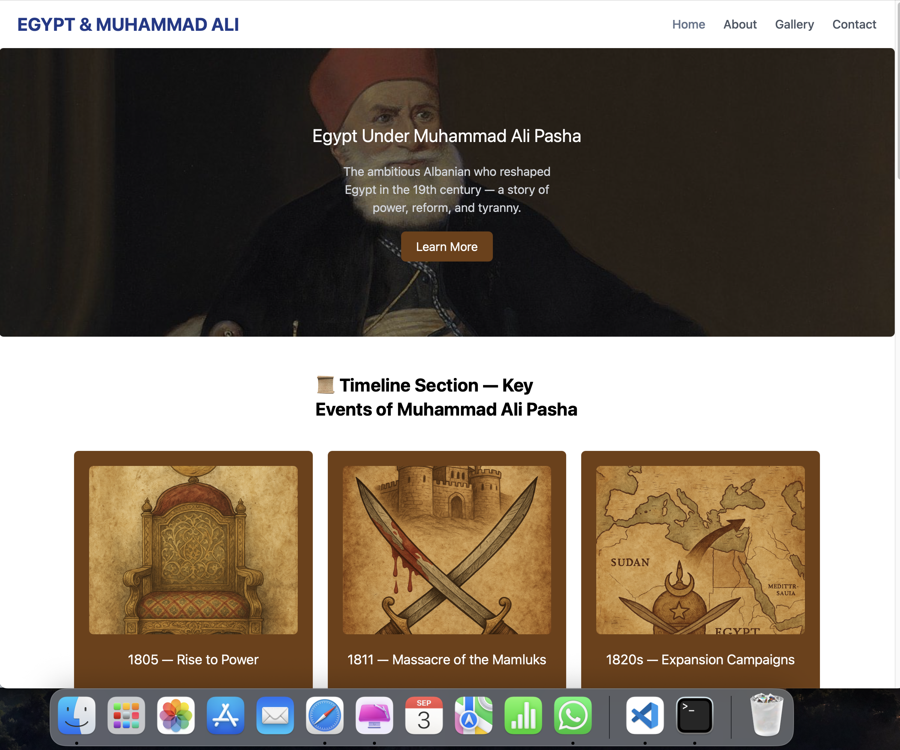
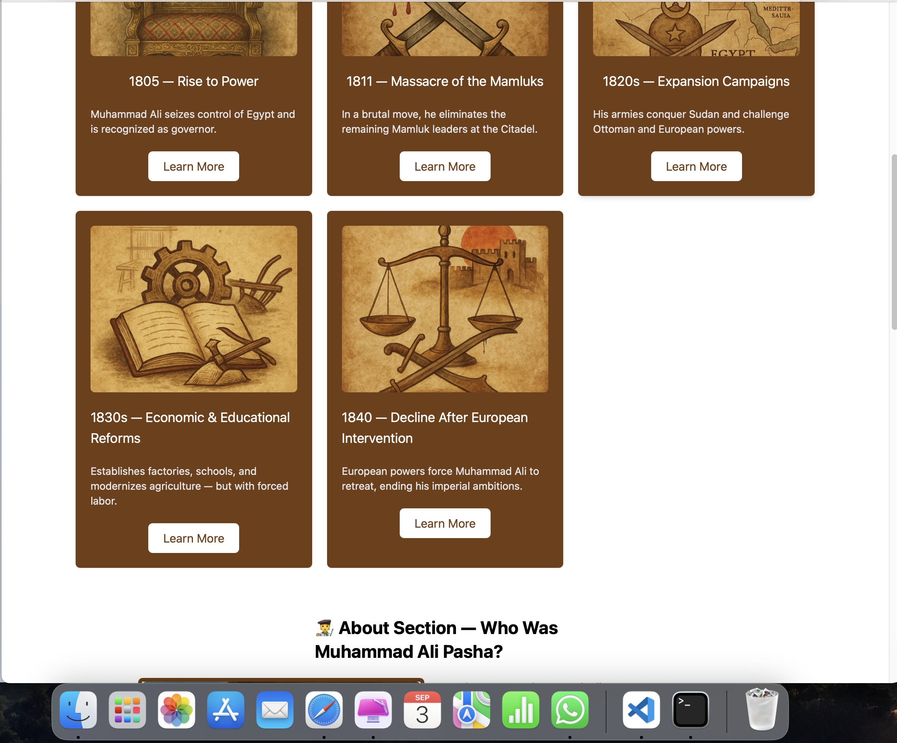
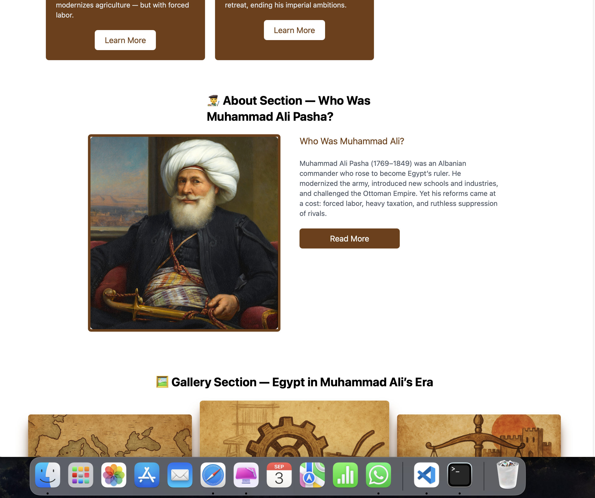
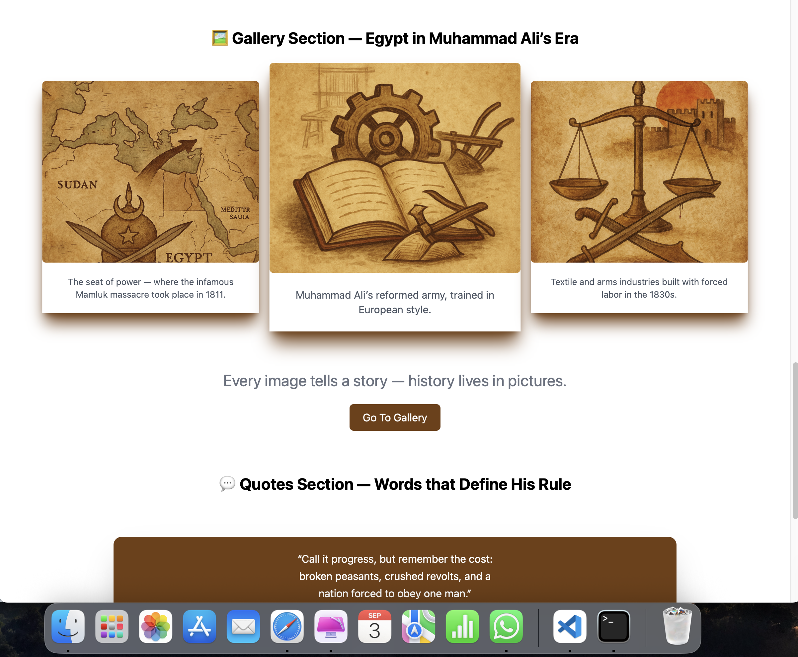
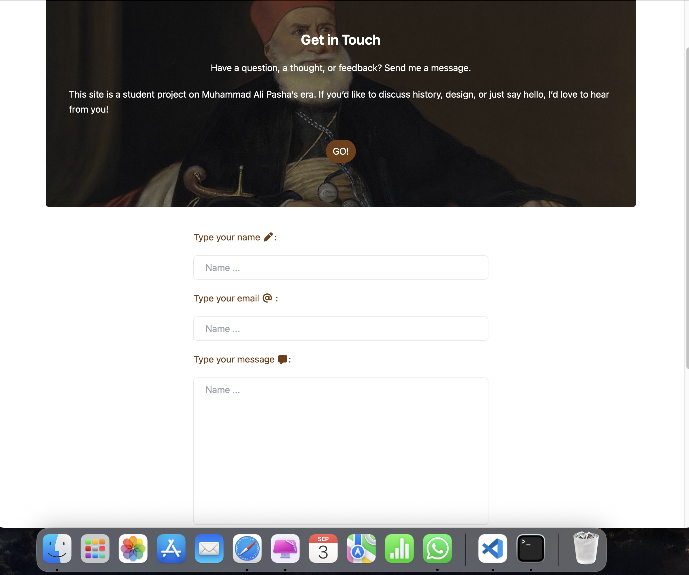
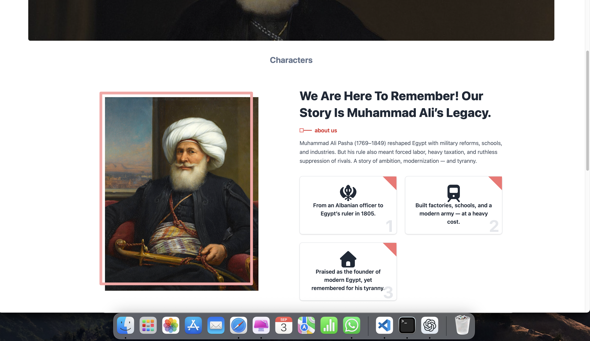
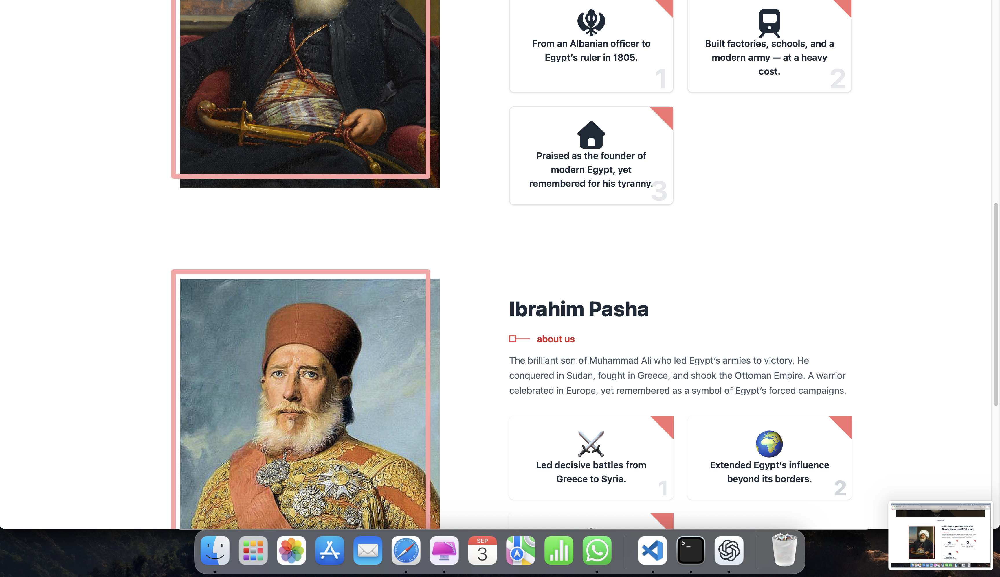

# Modern Egypt Figures — Frontend Training Project  
*(مشروع تدريبي في الواجهة الأمامية عن شخصيات مصر الحديثة)*

## 📖 About / عن المشروع
This is a lightweight **frontend training project** built with **HTML & Tailwind CSS**.  
It includes simple pages about **Muhammad Ali Pasha** and key figures in modern Egypt.  

⚠️ Note: This is **not** a full historical resource — it’s just a fun exercise in **design and layout** while learning frontend.

---

هذا مشروع تدريبي خفيف باستخدام **HTML و Tailwind CSS**،  
يحتوي على صفحات بسيطة عن **محمد علي باشا** وشخصيات بارزة في مصر الحديثة.  

⚠️ تنويه: هذا ليس مصدرًا تاريخيًا كاملاً، بل مجرد تجربة ممتعة في **التصميم والـ Front-End**.

---

## 🛠️ Built With / الأدوات المستخدمة
- HTML  
- Tailwind CSS  

---

## 🎯 Goals / الأهداف
- Practice using Tailwind CSS for layouts and styling.  
- Build a small multi-page project (Home, About, Gallery, Contact).  
- Learn how to organize content and design UI components.  

---

## 🚀 Live Demo / النسخة المباشرة
*(يمكنك رفعه على GitHub Pages أو Netlify وإضافة الرابط هنا لاحقًا)*

---

## 📜 License / الترخيص
Free to use and modify — for learning purposes only.  
حر للتعديل والاستخدام — لأغراض التعلم فقط

## 📸 Screenshots

### 🏠 Homepage

### 📬 Contact Page

### 🖼️ Gallery Page
.

### 🙎‍♂️ Characters Page
.
.
